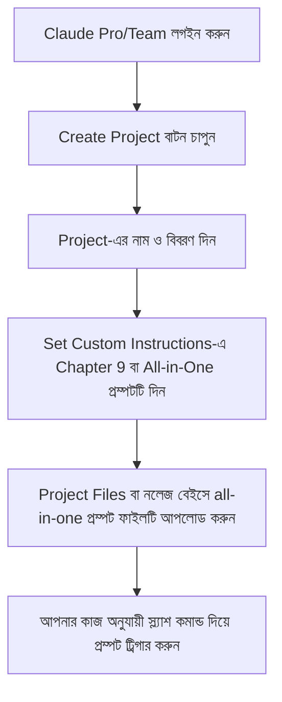

# 🚀 Claude SEO & AEO Playbook: ক্লোড (Claude) ব্যবহার করে প্রফেশনাল সার্চ অপ্টিমাইজেশন ও এআই সার্চ ভিজিবিলিটি (এ-টু-জেড গাইড)

ডিজিটাল মার্কেটিং এবং এসইও (SEO)-এর জগৎ খুব দ্রুত পরিবর্তিত হচ্ছে। এখন মানুষ শুধু গুগল বা বিং-এ সার্চ করেই ক্ষান্ত হয় না, বরং Perplexity, ChatGPT Search, Gemini এবং Google AI Overviews-এর মতো এআই অ্যানসার ইঞ্জিনগুলো সরাসরি উত্তর জানতে ব্যবহার করছে। 

এই নতুন যুগের সার্চ ইঞ্জিনের জন্য আপনার ওয়েবসাইটকে প্রস্তুত করার প্রক্রিয়াকে বলা হয় **AEO (Answer Engine Optimization)** এবং **GEO (Generative Engine Optimization)**।

আপনার কাজকে সহজ করতে আমরা তৈরি করেছি **Claude SEO & AEO Playbook**। এটি মূলত ১০টি অত্যন্ত শক্তিশালী ও কাস্টমাইজড প্রম্পটের সংকলন যা আপনার সাধারণ ক্লোড (Claude 4.8 / 4.6) চ্যাট বা ক্লোড প্রজেক্টকে (Claude Projects) একজন সিনিয়র এসইও অ্যানালিস্ট ও কনটেন্ট ইঞ্জিনিয়ারে রূপান্তর করবে। 

এই ব্লগে আমরা বিস্তারিত আলোচনা করব কীভাবে এই প্লে-বুকটি আপনার কাজে লাগতে পারে, কোন প্রম্পট কোথায় ব্যবহার করবেন এবং কীভাবে ক্লোডে এগুলো সেটআপ করবেন।

---

## 📂 সূচিপত্র (Table of Contents)
1. **এই প্লে-বুকটি কী কী কাজে লাগতে পারে? (Core Benefits & Use Cases)**
2. **এ-টু-জেড প্রম্পট নির্দেশিকা: কোন প্রম্পট কখন এবং কোথায় ব্যবহার করবেন?**
3. **মাস্টার অল-ইন-ওয়ান (All-in-One) প্রম্পট এবং স্ল্যাশ কমান্ডের ব্যবহার**
4. **কীভাবে Claude Projects-এ স্কিলগুলো আপলোড করবেন? (Step-by-Step Guide)**
5. **কখন ও কীভাবে কোন লিঙ্ক থেকে প্রম্পট কপি এবং ফাইল ডাউনলোড করবেন?**

---

## ১. এই প্লে-বুকটি কী কী কাজে লাগতে পারে? (Core Benefits & Use Cases)

এই প্লে-বুকটি ব্যবহার করে আপনি নিচের কাজগুলো খুব সহজেই সম্পন্ন করতে পারবেন:
*   **AEO & GEO অডিট:** এআই সার্চ ইঞ্জিনগুলো আপনার কনটেন্টকে সহজে রিড বা সাইট করতে পারবে কি না, তা যাচাই করা এবং সেই অনুযায়ী কনটেন্ট রিরাইট করা।
*   **ব্র্যান্ড আইডেন্টিটি ম্যাপিং:** আপনার ব্যবসা বা ওয়েবসাইটের মূল ভ্যালু, টার্গেট কাস্টমার এবং টোন অফ ভয়েস ক্লোডের ব্রেইনে স্থায়ীভাবে সেট করে দেওয়া।
*   **টপিক্যাল অথরিটি ম্যাপিং:** গুগল এবং এআই ইঞ্জিনে নির্দিষ্ট কোনো টপিক বা কি-ওয়ার্ডের ওপর রাজত্ব করতে পুরো ওয়েবসাইটের কনটেন্ট হাব এবং ইন্টারনাল লিঙ্কিং স্ট্রাকচার ডিজাইন করা।
*   **টেকনিক্যাল এসইও অডিট:** ওয়েবসাইটের ক্রল ডাটা, ৩০১ ডাইরেক্ট লুপ এবং ক্যানোনিকাল ইরর বিশ্লেষণ করে সমাধানের অ্যাকশন প্ল্যান তৈরি করা।
*   **স্কিমা জেনারেটর:** গুগল রিচ স্নিপেটের জন্য কোনো ভুল ছাড়াই নিখুঁত JSON-LD Schema জেনারেট করা।
*   **প্রতিদ্বন্দ্বী বিশ্লেষণ (Competitor SOV):** এআই সার্চ ইঞ্জিনে আপনার প্রতিদ্বন্দ্বীদের তুলনায় আপনার ব্র্যান্ড কতটা পরিচিত এবং কীভাবে তাদের সরিয়ে আপনার ব্র্যান্ডের নাম নিয়ে আসা যায় তার কৌশল সাজানো।
*   **গুগল সার্চ কনসোল অ্যানালিসিস:** সরাসরি GSC-এর CSV ফাইল ক্লোডে আপলোড করে "Quick Wins" (পজিশন ৮-১৫ এর কি-ওয়ার্ড) এবং কি-ওয়ার্ড ক্যানিবালাইজেশন চিহ্নিত করা।

---

## ২. এ-টু-জেড প্রম্পট নির্দেশিকা: কোন প্রম্পট কখন এবং কোথায় ব্যবহার করবেন?

এই প্লে-বুকে ১০টি চ্যাপ্টার বা ক্যাটাগরি রয়েছে। নিচে প্রতিটির কাজ, ব্যবহারের সঠিক সময় এবং ব্যবহারের সঠিক স্থান আলোচনা করা হলো:

### 📑 Chapter 1: AEO Foundations Auditor (`/aeo`)
*   **কখন ব্যবহার করবেন:** যখন কোনো নতুন ব্লগ পোস্ট বা ল্যান্ডিং পেজের ড্রাফট রেডি করেছেন এবং দেখতে চান এটি AI Answer Engines (যেমন Perplexity) সহজে সাইট (Cite) করবে কি না।
*   **কোথায় ব্যবহার করবেন:** ক্লোডের নরমাল চ্যাট বা ক্লোড প্রজেক্টে। ইনপুট হিসেবে আপনার ড্রাফট কনটেন্ট পেস্ট করুন।
*   **কী কাজ করে:** এটি আপনার লেখার **Factual Density Score** (কতটুকু তথ্যবহুল) এবং **Syntactic Extractability** (এআই সহজে বাক্যগুলো বুঝতে পারছে কি না) রেটিং দেয় এবং বাক্যগুলো রিরাইট করে দেয়।

### 📑 Chapter 2: Brand Context Mapping (`/brand`)
*   **কখন ব্যবহার করবেন:** যেকোনো প্রজেক্টের শুরুতে। ক্লোড যাতে আপনার ব্র্যান্ডের টোন, টার্গেট কাস্টমার এবং ইউএসপি (USP) সম্পর্কে একদম পরিষ্কার ধারণা পায়।
*   **কোথায় ব্যবহার করবেন:** ক্লোড প্রজেক্টের নলেজ বেইসে অথবা সিস্টেম ইনস্ট্রাকশনে। 
*   **কী কাজ করে:** আপনার দেয়া রফ ডকুমেন্টস বা কোম্পানির বিবরণী বিশ্লেষণ করে একটি সুনির্দিষ্ট JSON ফরম্যাটের ব্র্যান্ড গাইড তৈরি করে।

### 📑 Chapter 3: Entity-First Topical Authority Map (`/topical`)
*   **কখন ব্যবহার করবেন:** নতুন কোনো ওয়েবসাইট শুরু করার সময় অথবা বর্তমান ওয়েবসাইটের কনটেন্ট প্ল্যান বা কি-ওয়ার্ড ক্লাস্টার তৈরি করার সময়।
*   **কোথায় ব্যবহার করবেন:** কি-ওয়ার্ড রিসার্চের শুরুতে ক্লোডের চ্যাট ইন্টারফেসে।
*   **কী কাজ করে:** এটি আপনার মূল সীড কি-ওয়ার্ড (Seed Topic) নিয়ে ৩-৪ স্তরের সাব-টপিক এবং তাদের মধ্যকার ইন্টারনাল লিঙ্কিংয়ের আর্কিটেকচার ম্যাপ তৈরি করে দেয়।

### 📑 Chapter 4: Content Engineering for Retrieval (GEO) (`/geo`)
*   **কখন ব্যবহার করবেন:** পুরনো যে ব্লগগুলো গুগলে র‍্যাঙ্ক করছে না বা এআই সার্চ ইঞ্জিনগুলো যে পেজগুলোকে পাত্তা দিচ্ছে না, সেগুলোকে অপ্টিমাইজ করতে।
*   **কোথায় ব্যবহার করবেন:** কনটেন্ট রিরাইট করার সময়।
*   **কী কাজ করে:** কনটেন্টের শুরুতে ৩-লাইনের এক্সিকিউটিভ সামারি, স্পেসিফিক ডেফিনিশন ও ম্যাট্রিক্স এবং কম্প্যারিসন টেবিল যুক্ত করে লেখার ভিজিবিলিটি বাড়িয়ে দেয়।

### 📑 Chapter 5: Technical SEO & Schema Auditing (`/technical`)
*   **কখন ব্যবহার করবেন:** আপনার টেকনিক্যাল এসইও টুল (যেমন Screaming Frog বা Ahrefs) থেকে ক্রল ডাটা বা ইরর লগ ডাউনলোড করার পর।
*   **কোথায় ব্যবহার করবেন:** টেকনিক্যাল ফিক্স করার সময়।
*   **কী কাজ করে:** এটি রফ ক্রল লগ বিশ্লেষণ করে একটি হাই-মিডিয়াম-লো টেবিল তৈরি করে এবং ধাপে ধাপে সমাধানের গাইডলাইন দেয়।

### 📑 Chapter 6: Dynamic JSON-LD Schema Builder (`/schema`)
*   **কখন ব্যবহার করবেন:** নতুন কোনো পেজ বা আর্টিকেলে স্কিমা মার্কআপ (Local Business, Article, FAQ, Course ইত্যাদি) যুক্ত করার সময়।
*   **কোথায় ব্যবহার করবেন:** সরাসরি ক্লোডের চ্যাটে।
*   **কী কাজ করে:** এটি কোনো চ্যাট মেসেজ বা হাবিজাবি কথা ছাড়া সরাসরি কপি করার মতো ১০০% ভ্যালিড JSON-LD কোড আউটপুট দেয়।

### 📑 Chapter 7: Competitor Share-of-Voice Audit (`/sov`)
*   **কখন ব্যবহার করবেন:** যখন কোনো নির্দিষ্ট কি-ওয়ার্ডে Perplexity বা Gemini আপনার বদলে আপনার প্রতিযোগীদের সাইট করছে।
*   **কোথায় ব্যবহার করবেন:** কম্পিটিটর অ্যানালিসিসের সময়।
*   **কী কাজ করে:** এটি এআই ইঞ্জিনের আউটপুট বিশ্লেষণ করে বের করে কেন প্রতিদ্বন্দীকে নেওয়া হলো এবং তাকে বিট করার জন্য কী কী কনটেন্ট গ্যাপ পূরণ করতে হবে।

### 📑 Chapter 8: Title & Meta Snippet Optimizer (`/meta`)
*   **কখন ব্যবহার করবেন:** নতুন আর্টিকেল পাবলিশ করার সময় অথবা গুগলে পজিশন ভালো থাকলেও সিটিআর (CTR) কম থাকলে মেটা টাইটেল/ডেসক্রিপশন অপ্টিমাইজ করতে।
*   **কোথায় ব্যবহার করবেন:** পাবলিশিং ড্যাশবোর্ডে।
*   **কী কাজ করে:** ৬০ অক্ষরের টাইটেল এবং ১৫৫ অক্ষরের ৫টি আলাদা স্টাইলের (Curiosity, Minimal, Metric-driven ইত্যাদি) হাই-কনভার্টিং মেটা টেক্সট জেনারেট করে।

### 📑 Chapter 9: The Claude Project Workspace Setup (`/setup`)
*   **কখন ব্যবহার করবেন:** একটি নতুন ক্লোড প্রজেক্ট (Claude Project) খোলার সাথে সাথে।
*   **কোথায় ব্যবহার করবেন:** প্রজেক্টের **Set Custom Instructions** বক্সে।
*   **কী কাজ করে:** এটি ক্লোডের জন্য প্রজেক্টের ভেতরে কথা বলার ও কাজ করার কঠোর গাইডলাইন ও কোয়ালিটি কন্ট্রোল চ্যাকলিস্ট সেটআপ করে দেয়।

### 📑 Chapter 10: Automated Google Search Console Reporter (`/gsc`)
*   **কখন ব্যবহার করবেন:** প্রতি সপ্তাহে বা মাসে আপনার ওয়েবসাইটের সার্চ পারফরম্যান্স ট্র্যাক করতে।
*   **কোথায় ব্যবহার করবেন:** ক্লোড প্রজেক্টের চ্যাটে GSC performance CSV ফাইল আপলোড করে।
*   **কী কাজ করে:** এটি ডাটা প্রসেস করে ইম্প্রেশন বাড়ছে কিন্তু ক্লিক বাড়ছে না এমন পেজ, ক্যানিবালাইজেশন এবং সহজে র‍্যাঙ্ক করানো সম্ভব এমন কি-ওয়ার্ডগুলোর লিস্ট ও অ্যাকশন টাস্ক তৈরি করে।

---

## ৩. মাস্টার অল-ইন-ওয়ান (All-in-One) প্রম্পট এবং স্ল্যাশ কমান্ডের ব্যবহার

আপনি যদি চান এই ১০টি স্কিল বারবার আলাদা আলাদাভাবে কপি-পেস্ট না করে ক্লোডের একটি সিঙ্গেল চ্যাট বা প্রজেক্টেই অ্যাক্সেস করবেন, তবে আমাদের **All-in-One Master Prompt** ব্যবহার করতে পারেন।

### কীভাবে ব্যবহার করবেন:
১. প্রজেক্টের `all-in-one/` ফোল্ডার থেকে **[master_seo_aeo_prompt.md](all-in-one/master_seo_aeo_prompt.md)** ফাইলটি সম্পূর্ণ কপি করুন অথবা ফাইলটি ডাউনলোড করুন।
২. এটি আপনার ক্লোড প্রজেক্টের **Custom Instructions**-এ পেস্ট করুন অথবা ফাইলটি সরাসরি আপলোড করে দিন।
৩. এরপর চ্যাটে জাস্ট স্ল্যাশ কমান্ড দিয়ে যেকোনো স্কিল ট্রিগার করুন। যেমন:
   *   `[Paste content] /aeo` (অথবা `/ch1`) লিখলে ক্লোড শুধু AEO Foundations অডিট করবে।
   *   `[Paste company details] /brand` (অথবা `/ch2`) লিখলে ব্র্যান্ড ম্যাপ তৈরি হবে।
   *   `[Paste seed topic] /topical` (অথবা `/ch3`) লিখলে কি-ওয়ার্ড ম্যাপ রেডি হবে।
   *   `[Upload GSC CSV] /gsc` (অথবা `/ch10`) লিখলে রিপোর্ট তৈরি হবে।

---

## ৪. কীভাবে Claude Projects-এ স্কিলগুলো আপলোড করবেন? (Step-by-Step Guide)

আপনি যদি Claude Pro বা Team প্ল্যান ব্যবহার করেন, তবে **Claude Projects** ফিচারটি ব্যবহার করা সবচেয়ে সেরা উপায়।

### বিস্তারিত ধাপসমূহ:
1. **ধাপ ১ (প্রজেক্ট তৈরি):** ক্লোড এআই-তে লগইন করে ডানপাশের প্যানেল থেকে **Projects**-এ যান এবং **Create Project** বাটনে ক্লিক করুন।
2. **ধাপ ২ (কাস্টম ইনস্ট্রাকশন সেটআপ):** প্রজেক্টের ডানপাশে **Set Custom Instructions** বাটনে ক্লিক করুন। আমাদের প্লে-বুকের **Chapter 9** অথবা **All-in-One Master Prompt**-এর সম্পূর্ণ টেক্সটটি সেখানে পেস্ট করে দিন।
3. **ধাপ ৩ (নলেজ ফাইল আপলোড):** আপনি যদি অল-ইন-ওয়ান ফাইলটি ডাউনলোড করে থাকেন, তবে প্রজেক্টের **Files** অপশনে ক্লিক করে `master_seo_aeo_prompt.md` ফাইলটি আপলোড করে দিন। এর ফলে ক্লোডের কাছে প্লে-বুকের সম্পূর্ণ মেমোরি জমা থাকবে।
4. **ধাপ ৪ (ব্যবহার শুরু):** এবার চ্যাটে আপনার কনটেন্ট বা ফাইল দিয়ে কমান্ড করুন (যেমন: `/aeo` বা `/schema`) এবং প্রফেশনাল লেভেলের আউটপুট উপভোগ করুন।

---

## ৫. কখন ও কীভাবে কোন লিঙ্ক থেকে প্রম্পট কপি এবং ফাইল ডাউনলোড করবেন?

আমাদের প্রজেক্টের লাইভ ইন্টারফেস বা ড্যাশবোর্ডটি অত্যন্ত ইউজার-ফ্রেন্ডলি করে ডিজাইন করা হয়েছে। এটি অফলাইনেও ব্যবহার করা সম্ভব!

*   **সরাসরি কপি করার জন্য:** 
    *   প্রজেক্টের রুট ডিরেক্টরি থেকে [index.html](index.html) ফাইলটি যেকোনো ব্রাউজারে ডাবল ক্লিক করে ওপেন করুন।
    *   বামপাশের সূচিপত্র (TOC) থেকে যে চ্যাপ্টারের প্রম্পট চান তা সিলেক্ট করুন।
    *   কার্ডের ডানদিকের **Copy Prompt** বাটনে ক্লিক করুন। এটি আপনার ক্লিপবোর্ডে কপি হয়ে যাবে এবং ক্লোডে পেস্ট করতে পারবেন।
*   **ডাউনলোড করে সরাসরি ক্লোডে আপলোড করার জন্য:**
    *   আপনি যদি অল-ইন-ওয়ান প্রম্পটটি ডক হিসেবে রাখতে চান, তবে ড্যাশবোর্ডের সবার ওপরে থাকা **All-in-One Master Prompt** সেকশনের পাশে **Download** বাটনে ক্লিক করুন।
    *   এছাড়াও প্রতিটি চ্যাপ্টারের ওপরে ইন্ডিভিজুয়াল **Download** বাটন রয়েছে যা দিয়ে নির্দিষ্ট চ্যাপ্টারের প্রম্পট ডাউনলোড করে রাখা যায়।
*   **PDF ফাইল হিসেবে সেভ করার জন্য:**
    *   ড্যাশবোর্ড পেজে গিয়ে আপনার কীবোর্ডের `Ctrl + P` চাপুন অথবা ব্রাউজারের প্রিন্ট অপশনে যান।
    *   এটি সম্পূর্ণ প্লে-বুকটিকে সুন্দর ও প্রিন্ট-ফ্রেন্ডলি ফরম্যাটে PDF আকারে সেভ করতে সাহায্য করবে, যা আপনি আপনার ক্লায়েন্ট বা টিম মেম্বারদের সাথে শেয়ার করতে পারবেন।

---

> 💡 **প্রো-টিপ:** সবসময় ক্লোড মডেল হিসেবে **Claude 4.8 / 4.6** ব্যবহার করবেন। এই মডেলগুলো জটিল লজিক বুঝতে এবং টেকনিক্যাল এসইও অ্যানালিসিস করতে দারুণ পারফর্ম করে।

আপনার এসইও এবং এআই সার্চ ভিজিবিলিটি যাত্রা শুভ হোক! কোনো প্রশ্ন বা সাহায্যের জন্য রিপোজিটরির ইস্যু সেকশনে যোগাযোগ করতে পারেন।
